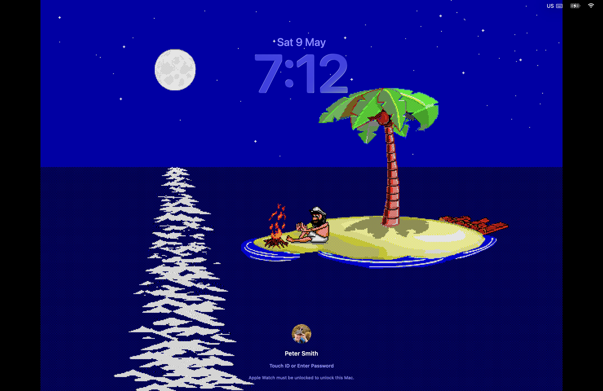

# Johnny Castaway — native macOS screensaver

A faithful native Swift 6 port of the 1992 Sierra/Dynamix
*Johnny Castaway* screensaver, packaged as a macOS `.saver` bundle.

The original 16-colour pixel art is rendered via Metal with
nearest-neighbour scaling, driven by a clean-room reimplementation of
Sierra's TTM/ADS bytecode interpreter, scene scheduler, walk-graph
pathfinder, and 11-day story arc.



*The screensaver running on macOS 26 Tahoe — Johnny resting under
the palm tree on a moonlit night, with the lock-screen overlay
showing it's a genuine `.saver` bundle.*

> **No Sierra data is included.** This repository contains only the
> reimplemented engine and renderer. To run the screensaver you must
> supply your own `RESOURCE.MAP`, `RESOURCE.001`, and `sound*.wav`
> files — see [Getting the data files](#getting-the-data-files) below.

---

## Status

**v1.3** — feature-complete and stable. Tested on macOS 26 Tahoe,
Apple Silicon. Runs unattended for hours. The multi-day story arc
has been observed advancing naturally across real calendar days
(raft growth, visitor scenes, holiday triggers); end-to-end
verification of all eleven days and the cycle wrap to day 1 is
ongoing as wall-clock days elapse.

Highlights:

- Full TTM/ADS bytecode interpreter (covers every opcode the canonical
  scripts exercise)
- Scene scheduler with day-of-story advancement, holiday detection,
  night/day cycle
- Walk-graph A* pathfinder
- 11-day story arc persisted across screensaver activations (v1.1)
- INTRO.SCR title screen with cycling wipe transitions on startup (v1.2)
- Configure sheet with animation speed, force-day, force-holiday,
  fidelity-mode, and debug overlay
- 104 engine unit tests, 11 renderer tests

v1.3 fixes:

- **Multi-hour freeze / black-screen-on-restart** — `MAX_TTM_SLOTS`
  was 6 (mis-copied from `MAX_BMP_SLOTS`). Visitor and final scenes
  reference TTM slot 6, so `adsAddScene` silently skipped loading
  that slot and then indexed out of range. Inside the
  `legacyScreenSaver` host this manifested as a runaway Swift
  exclusivity spin on the main thread, only triggered after hours
  when the 11-day scheduler happened to pick an affected scene. Slot
  count corrected to 10 (matching jc_reborn and the Go port). Fixed.
- **Settings not persisting across screensaver restarts** — on macOS
  Tahoe the configure sheet, preview process, and full-screen process
  each run in separate sandboxed containers. `ScreenSaverDefaults`
  writes were invisible across processes. Fixed via distributed
  notifications plus a direct ByHost plist write as a fallback.
- **Audio playing on all monitors** — macOS starts one
  `legacyScreenSaver` instance per display; audio is now gated to
  the main screen only. Fixed.

v1.2 fixes:

- **CPU spin** — `onBackgroundTick` wave-animation closure caused a
  Swift exclusivity spin after several hours, pegging one CPU core at
  99%. Fixed.
- **Sprite clipping** — SET_CLIP_ZONE was stored but not enforced in
  sprite and rect drawing, allowing sprites to appear above the palm
  canopy and above the island surface. Fixed.
- **Walk to Spot.A** — walk to the leftmost anchor was incorrectly
  skipped when the next scene started at that position. Fixed.
- **Scene-start flicker** — one stale frame flashed when a new scene
  began. Fixed.
- **Cloud placement** — cloud Y formula misread `rand() % (135-N)` as
  a lower bound rather than a range size, placing clouds too high. Fixed.
- **Intro hang** — black screen after the intro wipe when a resource
  failed to load. Fixed.

Known limitations are listed at the bottom of this README.

---

## Installation

### Pre-built (macOS 26 Tahoe, Apple Silicon)

If a release is published, grab the `.saver` zip from the
[Releases](../../releases) page, then:

1. Unzip — you'll get `JohnnyScreenSaver.saver`.
2. Copy it into `~/Library/Screen Savers/`.
3. Strip Gatekeeper's quarantine flag (the build is ad-hoc signed,
   not Apple-Developer-ID signed):

   ```sh
   xattr -dr com.apple.quarantine ~/Library/Screen\ Savers/JohnnyScreenSaver.saver
   ```

   *(Without this step, double-clicking the `.saver` will fail with
   "JohnnyScreenSaver cannot be opened because the developer cannot
   be verified."  An alternative is right-click → Open the first
   time, then accept the warning.)*

4. Open System Settings → Screen Saver → choose JohnnyScreenSaver.
5. Click **Screen Saver Options…**, point it at the folder
   containing your Sierra data files (see below), enable sound if
   you want it, choose a story-day or fidelity mode if you want.

### Build from source

Requires Xcode 16+ (Swift 6 toolchain) on Apple Silicon.

```sh
git clone https://github.com/tallPete/JohnnyCastaway.git
cd JohnnyCastaway
bash Apps/JohnnyScreenSaver/Scripts/build-saver.sh --install --reload
```

The script ad-hoc codesigns the bundle, copies it into
`~/Library/Screen Savers/`, and kills the running `legacyScreenSaver`
process so the new build is picked up. You can also build the
engine and tests via SwiftPM:

```sh
cd Packages/JohnnyEngine && swift test          # 104 engine tests
cd Packages/JohnnyMetalRenderer && swift test   # 11 renderer tests
```

---

## Getting the data files

The screensaver requires the original `RESOURCE.MAP` and
`RESOURCE.001` from the 1992 Sierra/Dynamix release; sound is
optional. Copy the files into a folder of your choosing, then point
the configure sheet at that folder.

For reference, the canonical files have these md5 hashes:

| File name    | size (bytes) | md5                              |
| ------------ | ------------ | -------------------------------- |
| RESOURCE.MAP |          —   | 374e6d05c5e0acd88fb5af748948c899 |
| RESOURCE.001 |          —   | 8bb6c99e9129806b5089a39d24228a36 |
| sound0.wav   |        10768 | 53695b0df262c2a8772f69b95fd89463 |
| sound1.wav   |        11264 | 35d08fdf2b29fc784cbec78b1fe9a7f2 |
| sound2.wav   |         1536 | f93710cc6f70633393423a8a152a2c85 |
| sound3.wav   |         7680 | 05a08cd60579e3ebcf26d650a185df25 |
| sound4.wav   |         5120 | be4dff1a2a8e0fc612993280df721e0d |
| sound5.wav   |         3072 | 24deaef44c8b5bb84678978564818103 |
| sound6.wav   |        15872 | eb1055b6cf3d6d7361e9a00e8b088036 |
| sound7.wav   |        15360 | cab94bace3ef401238daded2e2acec34 |
| sound8.wav   |         2560 | 39515446ceb703084d446bd3c64bfbb0 |
| sound9.wav   |         3584 | f86d5ce3a43cbe56a8af996427d5c173 |
| sound10.wav  |        20480 | 5b8535f625094aa491bf8e6246342c77 |
| sound12.wav  |         5632 | 8c173a95da644082e573a0a67ee6d6a3 |
| sound14.wav  |        11776 | e064634cfb9125889ce06314ca01a1ea |
| sound15.wav  |         3072 | b3db873332dda51e925533c009352c90 |
| sound16.wav  |         7680 | 2eabfe83958db0cad77a3a9492d65fe7 |
| sound17.wav  |         4608 | 2497d51f0e1da6b000dae82090531008 |
| sound18.wav  |        14336 | 994a5d06f9ff416215f1874bc330e769 |
| sound19.wav  |         3584 | 5e9cb5a08f39cf555c9662d921a0fed7 |
| sound20.wav  |         7680 | 80e7eb0e0c384a51e642e982446fcf1d |
| sound21.wav  |         5120 | 1a3ab0c7cec89d7d1cd620abdd161d91 |
| sound22.wav  |         1536 | a0f4179f4877cf49122cd87ac7908a1e |
| sound23.wav  |         2048 | 52fc04e523af3b28c4c6758cdbcafb84 |
| sound24.wav  |         9728 | 5a6696cda2a07969522ac62db3e66757 |

`sound11.wav` and `sound13.wav` are intentionally absent from the
canonical set; the engine silently skips them.

> **Note on the RESOURCE.MAP / RESOURCE.001 hashes:** the values
> above are empirically verified against a working install of this
> project (and they agree with the Go port's README).

The screensaver will not run without `RESOURCE.MAP` and
`RESOURCE.001`. Sound files are optional. The sound files have been
extracted by the JCOS project and made available at
<https://github.com/nivs1978/Johnny-Castaway-Open-Source/tree/master/JCOS/Resources>.

This repository contains no Sierra data files, takes no position on
where users obtain them, and provides no copies. The data files
remain Sierra/Dynamix intellectual property.

---

## How it works

```
RESOURCE.MAP / RESOURCE.001
        │
        ▼
JohnnyResources       parser: archive, palette, bitmap, TTM/ADS scripts
        │
        ▼
JohnnyEngine          interpreter: TTM threads, ADS scheduler,
                                   scene scheduler, walk graph,
                                   island/holiday state
        │
        ▼
JohnnyMetalRenderer   R8Uint indexed framebuffer + 16-entry palette LUT
                      shader, fractional-scale letterbox to fill the screen
        │
        ▼
JohnnyScreenSaver     ScreenSaverView host, configure sheet,
(.saver bundle)       resource folder onboarding, AVAudioPlayer sink
```

`JohnnyDebugApp` is a SwiftUI host that drives the same engine for
QA — frame scrubber, thread inspector, scene picker, force-date
controls.

---

## Configure sheet options

| Setting              | Default        | Notes                              |
|----------------------|----------------|------------------------------------|
| Resource folder      | (unset)        | Required; security-scoped bookmark |
| Enable sounds        | Off            | Default off due to Tahoe preview-pane orphan behaviour; toggle on if you want audio |
| Animation speed      | 1.0×           | 0.5× / 1× / 1.5× / 2×              |
| Story day            | Auto           | Override the 11-day arc for testing |
| Force holiday        | Off            | Halloween / St Patrick / Christmas / NY |
| Engine fidelity      | Fixed          | Fixed (Go-port corrections) / Raw (jc_reborn) |
| Show debug overlay   | Off            | Day / threads / opcodes / FPS HUD  |

Force-day and force-holiday are explicitly *temporary* — they don't
overwrite the persistent natural-progression story state.

---

## Acknowledgements

Firstly, please let me give credit to **Shawn Bird**, **Jeff Tunnell** and the **Dynamix team** who designed and produced the Johnny Castaway characters and code I've spent so much time watching.

This project stands on a long chain of prior reverse-engineering
work. None of it would have been possible without the people below;
many thanks to all of them.

Direct sources used by this Swift port:

- **`jc_reborn`** — the C/SDL2 port whose canonical TTM/ADS opcode
  interpretations, scene-scheduling logic, and resource-format
  decoding this engine follows. The vast majority of the
  algorithmic decisions in `JohnnyEngine` trace back to this
  project's analysis.
  <https://github.com/jno6809/jc_reborn>
- **`Johnny-Castaway-2026-Public`** — a Go/Raylib port whose
  source-level comments resolved several edge cases in our
  implementation (in particular the `DRAW_SPRITE` slot-index
  semantics that, when corrected, restored the sleep-Z animation,
  the visitor boat, and the walk-behind-the-palm-tree depth
  effect).

`jc_reborn` itself thanks the following people, and so do we — each
layer benefited from the prior:

- **Hans Milling** (aka `nivs1978`), author of the JCOS project —
  the original parsing/decoding of the data-file formats and the
  first understanding of many TTM/ADS instructions.
  <https://github.com/nivs1978/Johnny-Castaway-Open-Source> ·
  <http://nivs.dk/jc/>
- **Alexandre Fontoura** (aka `xesf`), author of the `castaway`
  JavaScript port.
  <https://github.com/xesf/castaway> ·
  <https://castaway.xesf.net/viewer/>
- **The Sierra Chest website** — comprehensive Johnny Castaway
  reference material, screenshots, and video captures used as
  cross-reference during development.
  <http://sierrachest.com/index.php?a=games&id=255&title=johnny-castaway>

And, indirectly via JCOS, thanks to:

- **Jeff Tunnel** — for help getting in contact with the original
  developers.
- **Kevin and Liam Ryan** — assistance with information about the
  resource files.
- **Jaap** — help in finding the format of the resource files.
- **Gregori** — assistance with the Lempel-Ziv decompression.
- **Guido** — author of the xBaK project that led to understanding
  the TTM and ADS commands.

The data files remain Sierra/Dynamix intellectual property; this
project provides no copies and takes no ownership claim over them.

---

## Development

This codebase was developed in collaboration with Anthropic's Claude
(via Claude Code). Co-authorship is recorded in commit trailers
(`Co-Authored-By: Claude …`).

The architecture follows the original plan in
`Native macOS Johnny Castaway Screensaver — Plan.md` — phases 0–6
plus v1.1 polish. Tests are split per-package:

- `Packages/JohnnyEngine/Tests/` — engine logic (103 tests)
- `Packages/JohnnyMetalRenderer/Tests/` — letterbox geometry (11 tests)
- `Packages/JohnnyResources/Tests/` — bitmap/archive parsing

Pull requests welcome, but please note this is a hobby project and
review cadence is best-effort.

---

## Known limitations

- **macOS 26 Tahoe orphan process.** When System Settings'
  screensaver preview is dismissed, the host `legacyScreenSaver`
  process can be left running in the background. A manual `killall legacyScreenSaver` cleans it
  up. Defending against this from inside the bundle is documented
  in `JohnnyScreenSaverView.swift` as a work in progress.
- **No CRT shader.** The renderer is nearest-neighbour pixel-
  perfect; a Phase 7 polish item would add a CRT/scanline filter.
- **Sound playback.** Default off. Plays at native sample rate
  (matches the original Sierra and jc_reborn).
- **`STAND.ADS` long ambient cycle.** Some idle scenes form a
  self-sustaining `IF_LASTPLAYED` chunk graph that the original
  Sierra cut short via wall-clock pacing pressure we don't
  reproduce. Bounded by an 8000-tick watchdog (~10 minutes worst
  case). See commit `f797d0c` for details.

---

## Licence

**[GPLv3-or-later](LICENSE)** for the source code in this repository
(full text in [COPYING](COPYING)).

This engine is a derivative work of [`jc_reborn`](https://github.com/jno6809/jc_reborn)
by Jeremie Guillaume, which is GPLv3-or-later: the TTM interpreter, the
ADS/scene scheduler, and the walk/path-finding code and data tables were
translated from its C source (see the per-file "Translated from …" headers
and the Acknowledgements above). Because of that, the combined work must be
distributed under the GPL — so anyone may use, modify, and even sell it, but
distributed derivatives must remain open under the GPL with source available.

The Sierra/Dynamix data files are not covered by this licence and are not
redistributed.

### Licensing history

Releases up to and including **v1.3** were published with an MIT licence.
That was a mistake: because this engine is a derivative work of the
GPLv3-or-later `jc_reborn`, MIT was not a licence the author was entitled to
grant. The project is **GPLv3-or-later from this point forward**, and the MIT
terms on those earlier builds should be disregarded. If you obtained an
earlier copy under MIT, please treat it as GPLv3-or-later.
